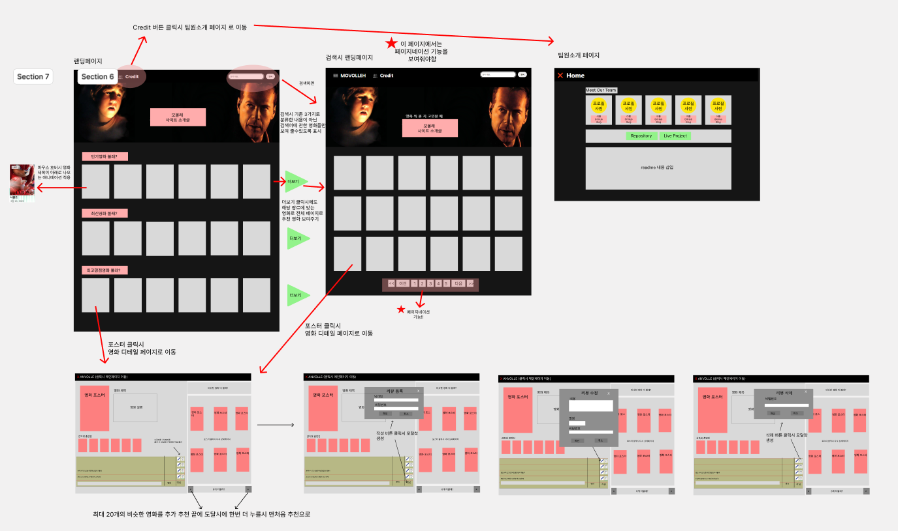
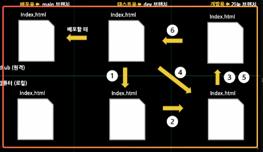
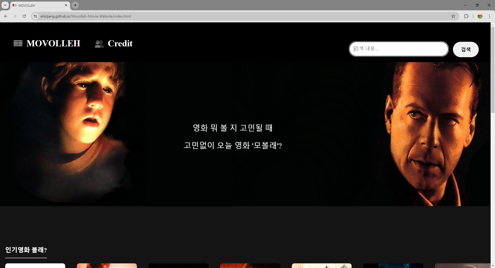
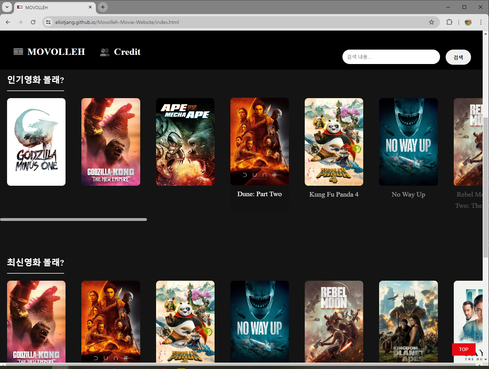
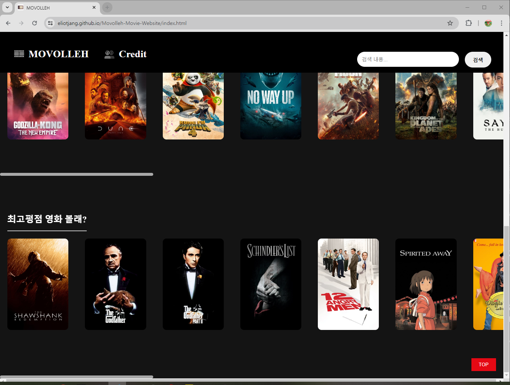
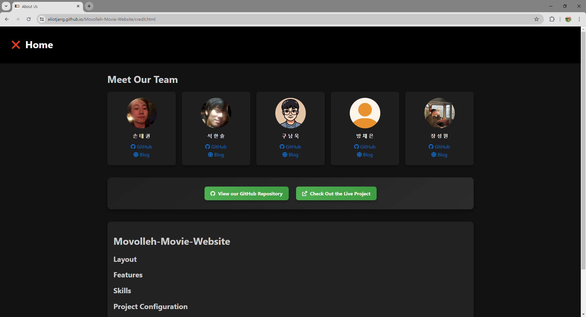
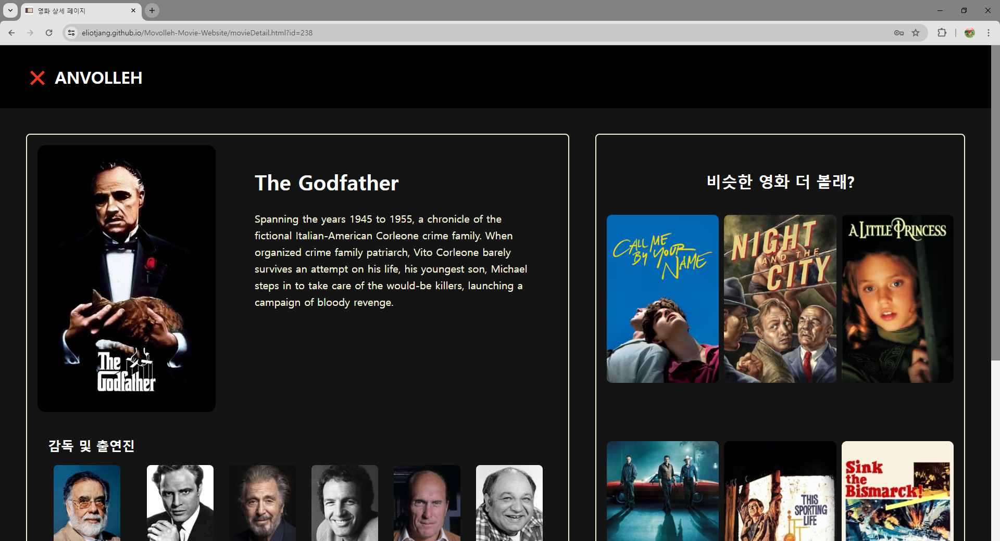
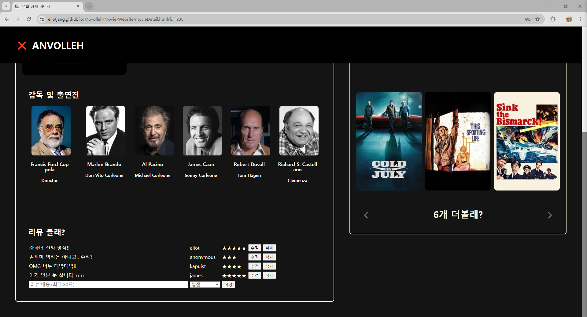

## 🎬 Movolleh Movie Website

- [배포 웹사이트 링크](https://eliotjang.github.io/Movolleh-Movie-Website/index.html)

## 📜 프로젝트 기획 및 설계

### Minutes of meeting

- [팀 프로젝트 S.A. 일정관리](https://eliotjang.notion.site/S-A-8dde9cfd6c864ea3b12a036c48337baf?pvs=4)
- [팀 프로젝트 회의록](https://eliotjang.notion.site/2a89927e3bc74e07b317adfa440ee9ea)
- [팀 프로젝트 발표 대본](https://docs.google.com/document/d/1X8udgnwtoX3nIWsoWKdALgqo5hk10tkq0dmO3jR3iJQ/edit?usp=sharing)
- [팀 프로젝트 포트폴리오](https://docs.google.com/presentation/d/1UNzq1Nac8eSAdEP5GFWPphxbIUfquHSPS7qvoYsIwOU/edit?usp=sharing)

### Used TMDB open API

- [TMDB Now Playing API](https://developer.themoviedb.org/reference/movie-now-playing-list)
- [TMDB Popular API](https://developer.themoviedb.org/reference/movie-popular-list)
- [TMDB Top Rated API](https://developer.themoviedb.org/reference/movie-top-rated-list)
- [TMDB Details API](https://developer.themoviedb.org/reference/movie-details)
- [TMDB Credits API](https://developer.themoviedb.org/reference/movie-credits)
- [TMDB Similar API](https://developer.themoviedb.org/reference/movie-similar)

### Wireframe

- 웹 기반 UI/UX 협업 툴, Figma 사용
- [Figma 협업 링크](https://www.figma.com/file/s9buq5bmNj29GUb6YuMWEZ/Untitled?type=design&node-id=17-39&mode=design&t=ztDeOEphbsYTa3nz-0)

### Code Convention

- `.prettierrc` 및 `reset.css` 사용 협업
- 변수 / 함수명 지정
  - Camel Case 사용 : `makeCard`
  - 변수명에 축약어 사용 금지 : `Del(x) Delete(o)`
  - DOM API 변수명과 클래스명 통일 : `const modal = document.querySelector(".modal")`
  - 변수명은 명사, 함수명은 동사 사용
  - 함수 작성 시 상단 주석 필수
  - 변수 / 함수명 20자 이내
- Scope 규칙
  - tap depth 길이 최대 4
  - 중괄호 앞 공백 추가
  - 조건문 끝 처리는 else if 사용 지양
  - Promise 사용 지양 및 async, await 사용 권장
- 주석 규칙
  - 한줄 `//`, 두줄 `/* */` 사용

### Github Collaboration Rules

<!-- {: width="100" height="100"} -->

### Github branch 생성 및 Pull Request 규칙

1️. remote `dev` branch에서 local `dev` branch로 pull  
2️. Github issue 생성 이후 `[issue별 자동 생성 브랜치명]` branch 생성
3️. local `[issue별 자동 생성 브랜치명]` branch에서 기능 구현 완료 후 remote `[issue별 자동 생성 브랜치명]` branch로 add, commit, push  
4️. local `[issue별 자동 생성 브랜치명]` branch에서 remote `dev` branch로 pull  
5️. local `[issue별 자동 생성 브랜치명]` branch에서 conflict 해결 후 remote `[issue별 자동 생성 브랜치명]` branch로 add, commit, push  
6️. local `[issue별 자동 생성 브랜치명]` branch에서 remote `dev` branch로 pull request

주의사항 : Issue 內 자동 생성 branch 명칭 수정 금지

## 💻 프로젝트 설명

### 🚀 Landing Page

`랜딩페이지 상단`  

`랜딩페이지 중단`  

`랜딩페이지 하단`  

- `MOVOLLEH` 버튼 : 홈페이지 새로고침
- `Credit` 버튼 : 팀 프로젝트 및 팀원 소개 페이지 이동
- `검색` 버튼 : 검색 내용을 포함하는 영화 제목 검색
  - 검색 후 동적 페이지네이션 기능으로 다른 페이지 이동 가능
- `인기영화 볼래?` : 인기 순으로 영화 정렬 및 더보기 기능
- `최신영화 볼래?` : 최신 순으로 영화 정렬 및 더보기 기능
- `최고평점 영화 볼래?` : 최고평점 순으로 영화 정렬 및 더보기 기능
  - 우측 스크롤 시 더보기 가능

### 😎 Credit Page

`팀 프로젝트 및 팀원 소개 페이지`  

- `View out GitHub Repository` : 웹페이지 배포 레포지토리 접근
- `Check out the Live Project` : 웹페이지 배포 링크 접근
- `Blog` 및 `Github` : 각 팀원의 블로그 및 깃허브 계정 접근

### 🧾 Description Page

`상세 페이지 상단`  

`상세 페이지 하단`  

- `ANVOLLEH` 버튼 : 랜딩 페이지 복귀
- 리뷰 `작성` 버튼 : 기입된 리뷰 내용과 별점을 localStorage에 저장후 출력
  - Validation Check
    1. 리뷰 내용 공백 불가
    2. 별점 미선택 불가
    3. 기존 리뷰와 동일한 작성자명 불가
    4. 공백 or 숫자로만 구성된 이름 불가
    5. 비밀번호 8자 이상, 숫자 및 특수문자 포함 필수
- 리뷰 `수정` 버튼 : 기입된 리뷰 내용, 별점 수정 이후 비밀번호를 검증하여 localStorage에 재저장후 출력
  - Validation Check
    1. 리뷰 내용 공백 불가
    2. 별점 미선택 불가
- `6개 더볼래?` 좌우측 화살표 버튼 : 상세 페이지 영화 기반 추천 영화 리스트 인기도 순 출력 및 더보기 가능

## 📂 프로젝트 구성

- src
  - crewDetail
    - [crewCard.js](https://github.com/eliotjang/Movolleh-Movie-Website/blob/dev/src/crewDetail/crewCard.js)
    - [movieDetail.js](https://github.com/eliotjang/Movolleh-Movie-Website/blob/dev/src/crewDetail/movieDetail.js)
  - modal
    - [modal.js](https://github.com/eliotjang/Movolleh-Movie-Website/blob/dev/src/modal/modal.js)
  - pagination
    - [pagination.js](https://github.com/eliotjang/Movolleh-Movie-Website/blob/dev/src/pagination/pagination.js)
  - review
    - [review.js](https://github.com/eliotjang/Movolleh-Movie-Website/blob/dev/src/review/review.js)
  - search
    - [search.js](https://github.com/eliotjang/Movolleh-Movie-Website/blob/dev/src/search/search.js)
  - tmdb-api
    - [api.js](https://github.com/eliotjang/Movolleh-Movie-Website/blob/dev/src/tmdb-api/api.js)
    - [option.js](https://github.com/eliotjang/Movolleh-Movie-Website/blob/dev/src/tmdb-api/option.js)
  - [main.js](https://github.com/eliotjang/Movolleh-Movie-Website/blob/dev/src/main.js)
  - [render.js](https://github.com/eliotjang/Movolleh-Movie-Website/blob/dev/src/render.js)
  - [similarMovies.js](https://github.com/eliotjang/Movolleh-Movie-Website/blob/dev/src/similarMovies.js)
  - [state.js](https://github.com/eliotjang/Movolleh-Movie-Website/blob/dev/src/state.js)
- style
  - [credit.css](https://github.com/eliotjang/Movolleh-Movie-Website/blob/dev/style/credit.css)
  - [index.css](https://github.com/eliotjang/Movolleh-Movie-Website/blob/dev/style/index.css)
  - [movieDetail.css](https://github.com/eliotjang/Movolleh-Movie-Website/blob/dev/style/movieDetail.css)
  - [reset.css](https://github.com/eliotjang/Movolleh-Movie-Website/blob/dev/style/reset.css)
  - [review.css](https://github.com/eliotjang/Movolleh-Movie-Website/blob/dev/style/review.css)
  - [similarMoviesStyle.css](https://github.com/eliotjang/Movolleh-Movie-Website/blob/dev/style/similarMoviesStyle.css)
- [credit.html](https://github.com/eliotjang/Movolleh-Movie-Website/blob/dev/credit.html)
- [index.html](https://github.com/eliotjang/Movolleh-Movie-Website/blob/dev/index.html)
- [movieDetail.html](https://github.com/eliotjang/Movolleh-Movie-Website/blob/dev/movieDetail.html)

## ✨ 사용 기술

    

## 👨‍👨‍👦‍👦 프로젝트 제작 인원

<table>
  <tbody>
    <tr>
      <td align="center"><a href="https://github.com/eliotjang"> <b> 팀장 : 장성원 </b></a> </td>
      <td align="center"><a href="https://github.com/9r3dflam3"> <b> 팀원 : 구남욱 </b></a> </td>
      <td align="center"><a href="https://github.com/CDR4733"> <b> 팀원 : 석한솔 </b></a> </td>
      <td align="center"><a href="https://github.com/KAPUIST"> <b> 팀원 : 손태권 </b></a> </td>
      <td align="center"><a href="https://github.com/xszvvfm"> <b> 팀원 : 방채은 </b></a> </td>
    </tr>
  </tbody>
</table>
